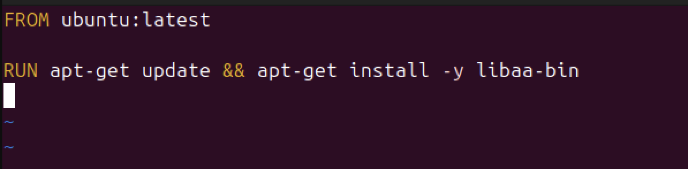
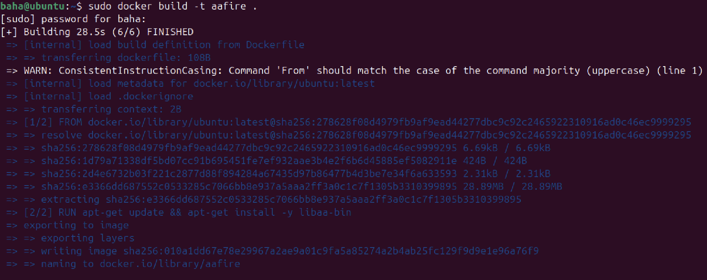
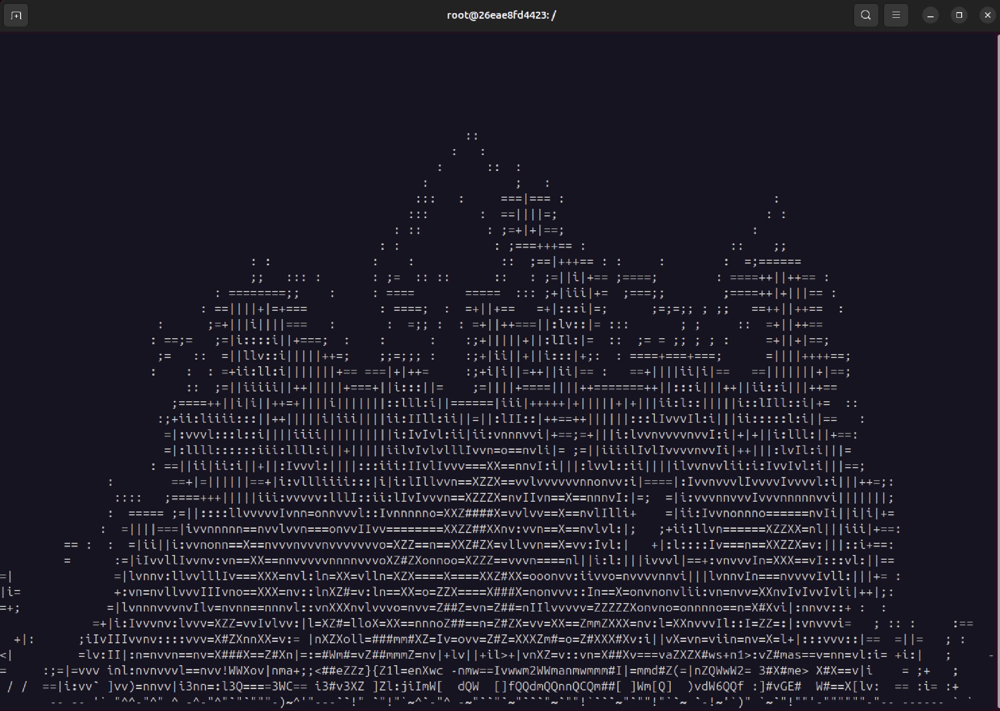
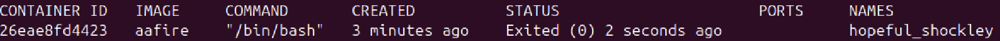
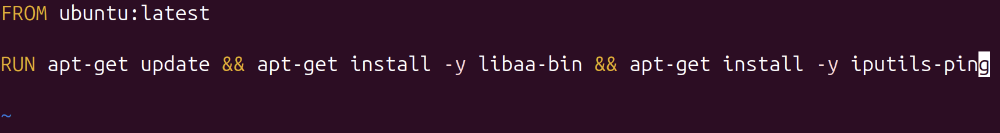
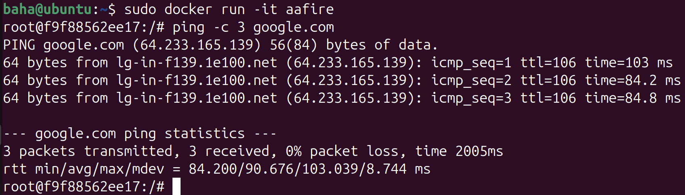
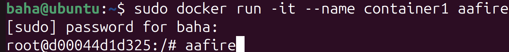
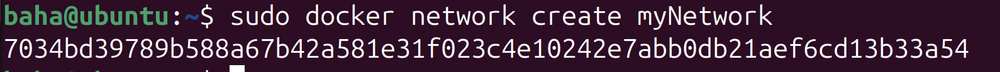
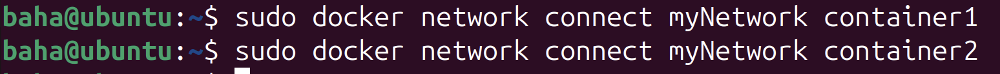
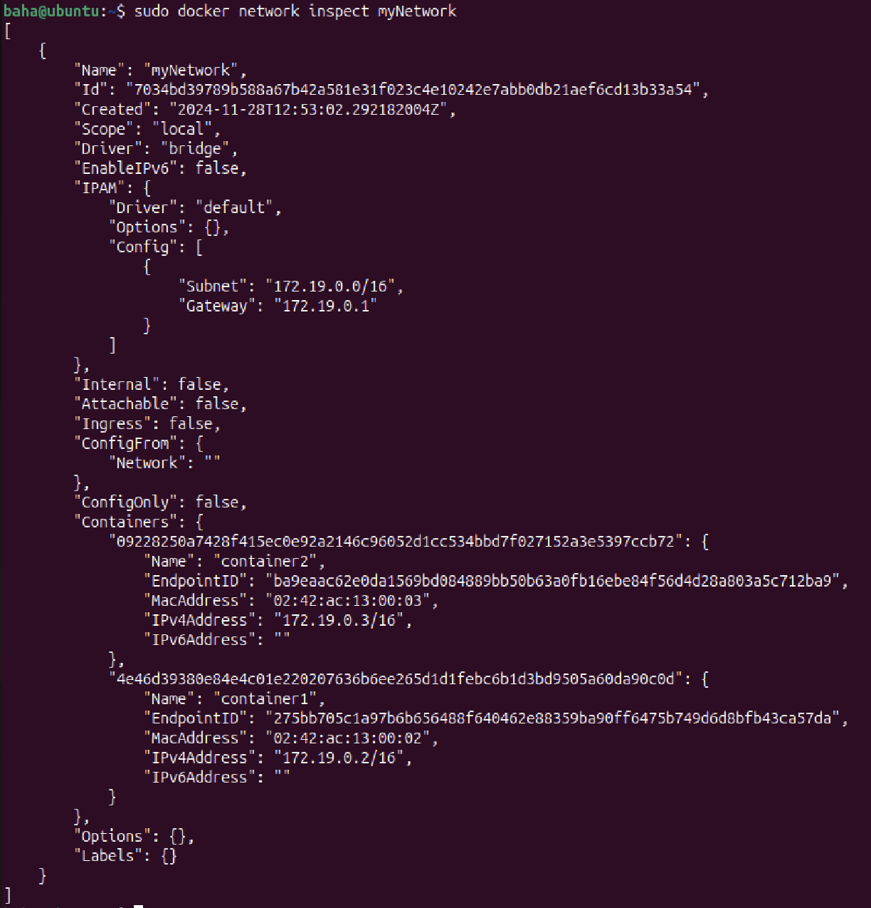

# Лабораторная работа 2

Сделал: `Ахмедов Бахадыр`
## Часть 1

Создаем `Docker image` (образ)

`RUN apt-get update && apt-get install -y libaa-bin`

Обновляем пакетный менеджер и устанавливаем ПО под названием `aafire`.

## Часть 2

Затем запускаем команду сборки образа с тегом `aafire`

`docker build -t aafire .`

Запускаем контейнер на основе созданного образа

проверяем запущенный контейнер

## Часть 3
 Устонавливаем утилиту `ping` 

Затем запускаем команду сборки образа 

`sudo docker build -t aafire .`

Проверяем:

 запускаем два контейнера с `aafire`
 при помощи комнады 
 sudo docker 
 `run -it --name container1 aafire"` и `run -it --name container2 aafire"`

Проверяем:

## Часть 4

Создадим сеть

Подключим контейнеры к сети 

Просмотрим настройки созданной сети.

 Протестируем соединение между контейнерами.

